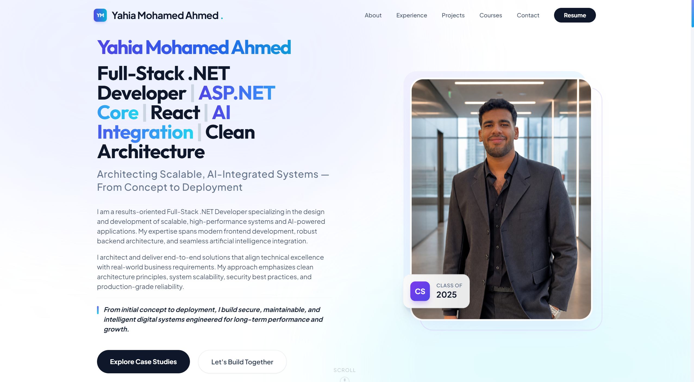

<div align="center">

# Yahia Mohamed Ahmed
### Full-Stack .NET Developer | ASP.NET Core | React | AI Integration | Clean Architecture

[](https://linkedin.com/in/yahia-mohamedd)
[](https://github.com/yahia-mosa)
[](mailto:yahiamosa2004@gmail.com)
[](https://drive.google.com/file/d/1B9FW1MKniaLD_-q6OI1l_2VaMKCdiaVT/view?usp=drive_link)

**Architecting Scalable, AI-Integrated Systems — From Concept to Deployment**


</div>

---

## 🚀 About

I'm a results-oriented **Full-Stack .NET Developer** specializing in the design and development of scalable, high-performance systems and AI-powered applications. My expertise spans modern frontend development, robust backend architecture, and seamless artificial intelligence integration.

I architect and deliver end-to-end solutions that align technical excellence with real-world business requirements, emphasizing clean architecture principles, system scalability, security best practices, and production-grade reliability.

---

## 🛠 Tech Stack

| Category | Technologies |
| :--- | :--- |
| **Backend** | .NET, ASP.NET Core, REST APIs, SQL Server, MySQL, Entity Framework Core |
| **Frontend** | React, React Native, Next.js, TypeScript, Tailwind CSS |
| **AI & Data** | Machine Learning, Deep Learning, NLP, Gemini API, TensorFlow, Predictive Modeling |
| **Cloud & DevOps** | Docker, CI/CD, AWS, Google Cloud |
| **Architecture** | Clean Architecture, SOLID, Design Patterns, OOP, System Design |

---

## 🌟 Featured Projects

### 🏥 AI-Powered Integrated Healthcare Assistant
An intelligent healthcare system (ITIDA Sponsored) for early disease prediction and real-time monitoring.
- **Tech:** Python, TensorFlow, React Native, Firebase, REST APIs.
- **Impact:** Predicted diabetes and heart disease with 98%+ accuracy.

### 💼 SalesPulse AI – CRM Platform
Scalable full-stack CRM and sales intelligence platform with AI-driven forecasting.
- **Tech:** React, TypeScript, ASP.NET Core 8, EF Core, SQL Server, JWT, Docker, Gemini API.
- **Features:** Clean Architecture, JWT auth, and Gemini-powered forecasting.
- **GitHub:** [github.com/yahia-mosa/SalesPulseAI](https://github.com/yahia-mosa/SalesPulseAI)

### 💰 MoneyMate – AI Finance Platform
AI-powered financial management platform for tracking income, expenses, and budgeting goals.
- **Tech:** React, .NET 8, SQL Server, JWT, EF Core, REST APIs, Gemini API.
- **Features:** Predictive budgeting and multilingual support (RTL).

### 🍔 Bites – Food Ordering Platform
Modern full-stack food ordering web application featuring real-time order tracking via SignalR WebSockets.
- **Tech:** .NET 10, ASP.NET Core, Entity Framework Core, SQL Server, React 19, Redux Toolkit, SignalR, Stripe, JWT, TailwindCSS.
- **Features:** Customer and admin interfaces, real-time order tracking, payment processing.
- **GitHub:** [github.com/yahia-mosa/Bites](https://github.com/yahia-mosa/Bites)

---

## 🛠️ Run Locally

**Prerequisites:** Node.js

1.  **Clone the repository:**
    ```bash
    git clone https://github.com/yahia-mosa/yahia-s-portfolio.git
    cd yahia-s-portfolio
    ```

2.  **Install dependencies:**
    ```bash
    npm install
    ```

3.  **Run the application:**
    ```bash
    npm run dev
    ```

The application will open on http://localhost:3000

---

## 📫 Contact Info
- **Email:** [yahiamosa2004@gmail.com](mailto:yahiamosa2004@gmail.com)
- **LinkedIn:** [yahia-mohamedd](https://linkedin.com/in/yahia-mohamedd)
- **WhatsApp:** [+20 1110666420](https://wa.me/201110666420)
- **Resume:** [View Resume](https://drive.google.com/file/d/1B9FW1MKniaLD_-q6OI1l_2VaMKCdiaVT/view?usp=drive_link)

<div align="center">
  <sub>Built with ❤️ by Yahia Mosa</sub>
</div>